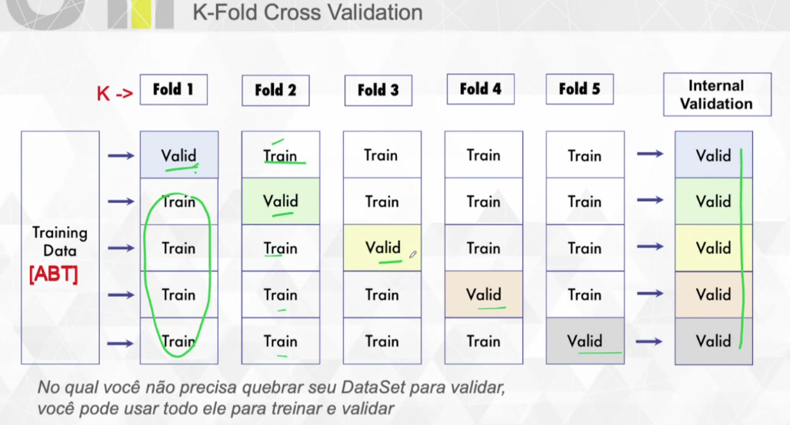

**Modelagem Prescritiva

Encontrar a solução ideal no meio de muitas outras soluções

Otimo Global x Otimo Local

Você assume que aquela é a melhor opção, pois nao temos o tempo infinito

Otimo local = Bom, mas nao tem certeza que é o melhor possivel
Otimo Global = Dificil de achar (Melhor possivel no tempo hábil)

Euristica - Sempre na Dúvida Exemplo de Relacionamentos (você assume que aquilo é o melhor, pois contempla todas as restrições de satisfações que você deseja)

*Determinístico
Convex - Convergir para uma solução unica (Otimo global)

Lineares (LP) - Problema simples - Se fizer uma coisa especifica o proximo passo é previsivel (Exemplo copo de agua)
Não Linear (NLP) - Comportamento não previsivel - Se fizer uma coisa o próximo passo não é previsivel, resultado a totalmente inesperado (Exemplo Apostar)

Non-Convex - 

Continuos (NLP) - Uma reta com valores quebrados 1.1, 1.2, 1.3 etc

Discrete - Exemplo aumentar de um em um

Bibliotecas - Pyomo, Cplex, Gurobi

*Stochatic - Teoria do jogos, Simulação de Monte Carlo -> Extamente igual o filme do efeito borboleta, Procurando todos os futuros possiveis. Pegar um dardo e jogar para acertar, existe inifinitas possibilidades pois voce pode errar o alvo
Criar cenarios

Modelagem Prescritiva - Busca Tabu

Faz uma varredura apos cada passo para ver o mais próximo da onde ele quer chegar

Modelagem - primeira solução aleatoria

Genetic Algorithm - Teoria evolucionista de Darwin - Gera aleatoriamente 100 soluções, pega 50 cruza com as outras 50 para gera uma terceira população e dai ve quem se eles sobrevivem

Na modelagem prescritiva o modelo é nao apenas uma linha de código

** Validação 
treino - validação - teste
Aprender com o passado para resolver no futuro
Segura 30% da base para testar no final

Quanto tempo é necessario para o treinamento?
Quanto mais dado maior, pois nao é apenas para otreino e sim para teste e validação.

** Validação ExPost 
Avançado continuamente treino - validação - teste (rolling)
Massa de treino do passado X massa de teste o mais proximo do presente

(A variavel é muito importante, determinante? Se sim usa a metologia de Expost, caso nao usa a K-Fold)

** K fold - Otimo em qualquer tempo 
