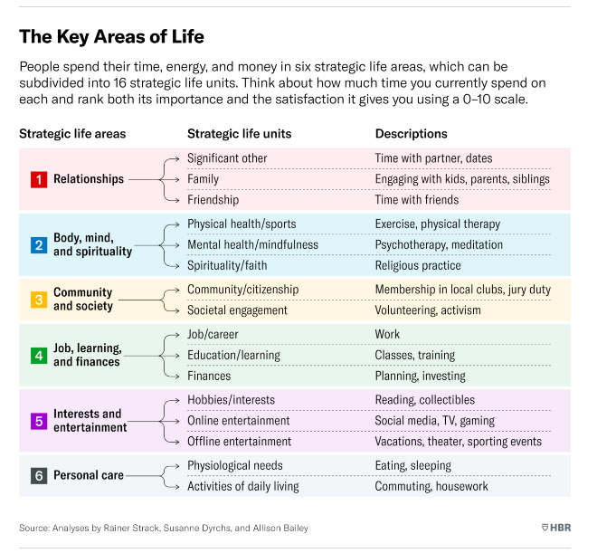

Life Strategy 
An integrated set of choices taht integrated a peopel to live better

1. How do i define a greate life?
Positive emotions
Engagement
Relationships
Meaning
Achievement
Vitality
2. WHat is my life purpose?
What are we good at? and What does the world need?, and takes into account, What are our values? and What excites us? Which activities light me up?
3. What is my life vision?
Individuals should also strive to envision who they want to become in the years ahead.
4. How do I asses my life portfolio?
BCG Matrix - Where invest money and time.
Strategic life areas (SLAS)

Divide an average week among the 16 strategic life units
Rate the importance of each SLU (0 to 10)
Rate the level of satisfaction with each SLU (0 to 10)

5. What can i learn from beanchmarks?
6. What portfolio choices can i make?
7. How can i ensure successful, sustained life change?

Decidir a proxima decada
Planejar os proximos anos
O que eu posso fazer em uma decada?
Definir o porque para os proximos anos

Que tipo de trabalho quero estar fazendo
Que tipo de relacionamento quero ter com a minha familia e amigos
Que tipo de habilidades quero ter masterezido
O que quero estar fazendo por diversao

O que vou poder focar para chegar la.
O que eu preciso fazer diariamente para chegar la.

Colocar metas para o mes, proximo 3 meses, proximo ano

Create blocks time no calendar

Planejar meu dia, pergunta qual a coisa mais importante do dia,
Just get started, começar é o que importa
Estar focado no que estamos fazendo